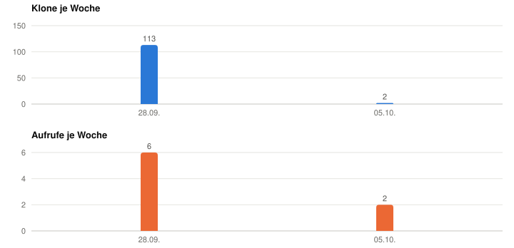
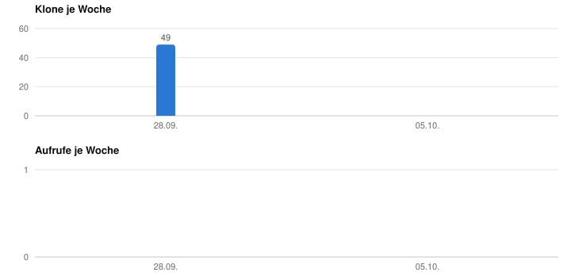
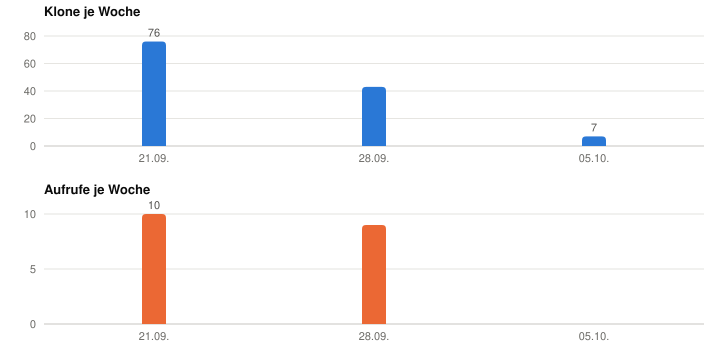

# 📈 Repo-Statistik — keep your GitHub repos' traffic numbers for good, not 14 days

> **Created by Sertac · Made by [NetBoosting](https://netboosting.de)** · Free to use under the MIT license · 🇩🇪 [Deutsche Anleitung](README.de.md)


GitHub shows you how often each repo was viewed and cloned. But only for the last 14 days,
then it is gone. Repo-Statistik ("repo statistics") is a GitHub Action that fetches those
numbers every Monday, stores them in your own repo and shows them as a table and a chart.

That is enough to see whether your tools get used. You do not need to build a heartbeat or
telemetry into your programs: every install of a Claude Code plugin, every `git clone`,
every visit to the repo page is already in GitHub's numbers. This tool only keeps them
before GitHub throws them away.

The tool itself sends us an anonymous heartbeat. The section "What the tool sends" lists
exactly what is in it and how to turn it off.

## These are our real numbers

This repo is the guide and the result at the same time. The block below is rewritten by the
tool every Monday with the numbers of our public repos.

<!-- statistik:start -->
As of 2026-10-07 11:44 UTC. This block is written by the tool; manual edits will be overwritten.

### Sertac0708/feature-scout

- Stars 2 · Forks 0 · Watchers 1 · open issues 0
- Last 14 days per GitHub: 115 clones from 75 machines, 8 views from 6 visitors
- Since recording began (2026-09-28): 115 clones, 8 views

<picture>
  <source media="(prefers-color-scheme: dark)" srcset="grafik/feature-scout-dunkel.svg">
  
</picture>

| Week of | Clones | Views | Days with data |
|---|---:|---:|---:|
| 2026-10-05 | 2 | 2 | 2 |
| 2026-09-28 | 113 | 6 | 7 |

Referrers (unique visitors, 14 days): github.com (1)

### Sertac0708/siteground-deploy

- Stars 0 · Forks 0 · Watchers 0 · open issues 0
- Last 14 days per GitHub: 49 clones from 37 machines, 0 views from 0 visitors
- Since recording began (2026-10-02): 49 clones, 0 views

<picture>
  <source media="(prefers-color-scheme: dark)" srcset="grafik/siteground-deploy-dunkel.svg">
  
</picture>

| Week of | Clones | Views | Days with data |
|---|---:|---:|---:|
| 2026-10-05 | 0 | 0 | 2 |
| 2026-09-28 | 49 | 0 | 7 |

### Sertac0708/github-repo-pruefer

- Stars 1 · Forks 0 · Watchers 0 · open issues 0
- Last 14 days per GitHub: 126 clones from 81 machines, 19 views from 4 visitors
- Since recording began (2026-09-27): 126 clones, 19 views

<picture>
  <source media="(prefers-color-scheme: dark)" srcset="grafik/github-repo-pruefer-dunkel.svg">
  
</picture>

| Week of | Clones | Views | Days with data |
|---|---:|---:|---:|
| 2026-10-05 | 7 | 0 | 2 |
| 2026-09-28 | 43 | 9 | 7 |
| 2026-09-21 | 76 | 10 | 5 |

Referrers (unique visitors, 14 days): github.com (1)

### Sertac0708/repo-statistik

- Stars 0 · Forks 0 · Watchers 0 · open issues 0
- Last 14 days per GitHub: 0 clones from 0 machines, 0 views from 0 visitors
- Since recording began (2026-10-07): 0 clones, 0 views

<picture>
  <source media="(prefers-color-scheme: dark)" srcset="grafik/repo-statistik-dunkel.svg">
  
</picture>

| Week of | Clones | Views | Days with data |
|---|---:|---:|---:|
| 2026-10-05 | 0 | 0 | 3 |
<!-- statistik:end -->

## How it works

- `werkzeuge/sammeln.py` queries GitHub's traffic API for every repo in `repos.txt`: views
  and clones per day, referrers, most visited paths, plus stars, forks and watchers.
- Daily values are merged by date into `daten/<repo>.json`. If one run fails, the next one
  still covers the gap: GitHub serves 14 days, the tool runs weekly.
- From that it draws two charts per repo in `grafik/` (light and dark, GitHub picks the
  right one) and writes the numbers block into this README.
- The Action `.github/workflows/statistik.yml` runs Mondays at 06:00 UTC, commits the
  changes as a bot and emails you only when something fails.

Python standard library only. No dependencies, no third-party service, no JavaScript.

## Setup

### Way A: use the repo as a template (no Claude needed)

You need a GitHub account. The GitHub CLI `gh` is handy but optional.

1. Top right: **Use this template → Create a new repository**. Private or public, your call.
2. In your copy, open `repos.txt` and list your repos, one per line as `owner/name`. Remove
   our data: empty the folders `daten/` and `grafik/`. Leave the numbers block in the READMEs,
   the first run overwrites it.
3. Create a token: GitHub → Settings → Developer settings → Personal access tokens →
   **Fine-grained tokens** → Generate new token. Repository access: **Only select
   repositories**, pick the repos from `repos.txt`. Repository permissions:
   **Administration: Read-only**; Metadata is added automatically. Nothing else. Pick any
   expiry, GitHub emails you before it runs out.
4. Store the token as a secret: repo → Settings → Secrets and variables → Actions →
   **New repository secret**, name `STATISTIK_TOKEN`. Or in the terminal:

   ```bash
   gh secret set STATISTIK_TOKEN -R YOUR-NAME/YOUR-REPO
   ```

   The command prompts for the value: paste once, press Enter. Nothing is echoed.
5. Start the first run: Actions → **Statistik sammeln** → Run workflow. A minute later the
   table and chart are in the README.

From then on it runs every Monday by itself. To watch another repo, add a line to
`repos.txt` **and** add the repo to the token, otherwise the run reports 404.

A separate token is needed because the traffic API requires the "Administration: read"
permission, which the automatic token of an Action does not have. The token can only read,
and only the repos you selected.

### Way B: as a Claude Code plugin

```bash
claude plugin marketplace add Sertac0708/repo-statistik
```
```bash
claude plugin install repo-statistik@repo-statistik
```

Restart Claude Code and say: *"Set up Repo-Statistik for my repos."* Claude creates the copy,
fills in your repos and walks you through the token step. You never paste the token into
the chat; Claude has you enter it in the terminal. Later you ask: *"How are my repos
doing?"*, and Claude reads the numbers from your statistics repo and puts them in context.

Updates:

```bash
claude plugin marketplace update repo-statistik
```

### Way C: copy the skill by hand

Copy the folder `skills/repo-statistik` into `~/.claude/skills/`. Same effect as way B,
without updates.

## Run it locally

```bash
STATISTIK_TOKEN=$(gh auth token) python3 werkzeuge/sammeln.py
```

Same result as in the Action, just on your machine. Useful to check the token and
`repos.txt` before the first push.

## Reading the numbers

- **Clones** are the best signal for usage. Every plugin install through a Claude Code
  marketplace is a `git clone`. But bots, mirror services and CI runs clone too, and your
  own clones count as well. Many clones with few views usually means that machines did most of the cloning.
- **Views** are people who looked at the repo page.
- **Unique** is only reliable for the 14-day figure GitHub reports itself. Daily values
  cannot be summed up; the same machine counts again every day. That is why the tool
  stores the 14-day figure separately on every run.
- **Watch the trend.** One week says little. After two months you can tell interest from
  noise.

## What the tool sends and stores

To GitHub: the queries with your token, inside your Action. The results go into your repo.

To us: one heartbeat per run. It is the only way we learn how many installations of the tool
are running, and it is built the way we would want a heartbeat in someone else's software to
be built. It contains exactly four things:

- a random install id, created on the first run and kept in `daten/install-id.txt`
- the tool version
- the number of watched repos, only the number
- whether the run succeeded

No repo names, no traffic numbers, no people. The receiver runs on Railway, stores no IP
addresses, not even in its access log, and its code is public in [`heartbeat/`](heartbeat/).
The total is the badge at the top and <https://heartbeat-production-40b4.up.railway.app/zahlen>.

To turn it off: in your repo go to Settings → Secrets and variables → Actions → Variables
and set `DO_NOT_TRACK` to `1`. Locally, the same environment variable works. The run then
reports "Heartbeat: aus" and sends nothing. Everything else works as before. More in
[PRIVACY.md](PRIVACY.md).

## Limits

- GitHub only hands out traffic for repos where you are an admin. You cannot watch other
  people's repos.
- Whatever was older than 14 days when you set it up is gone.
- A run takes under a minute of Actions time. Free for public repos; for private repos it
  counts against your monthly quota.
- If the token expires, the run turns red and GitHub emails you. Set a new token.

## License and contact

MIT license. Created by Sertac, published by [NetBoosting](https://netboosting.de).
Questions and bugs: [Issues](https://github.com/Sertac0708/repo-statistik/issues).
